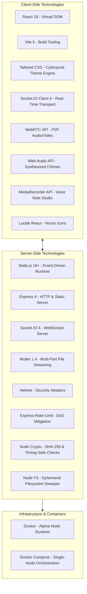
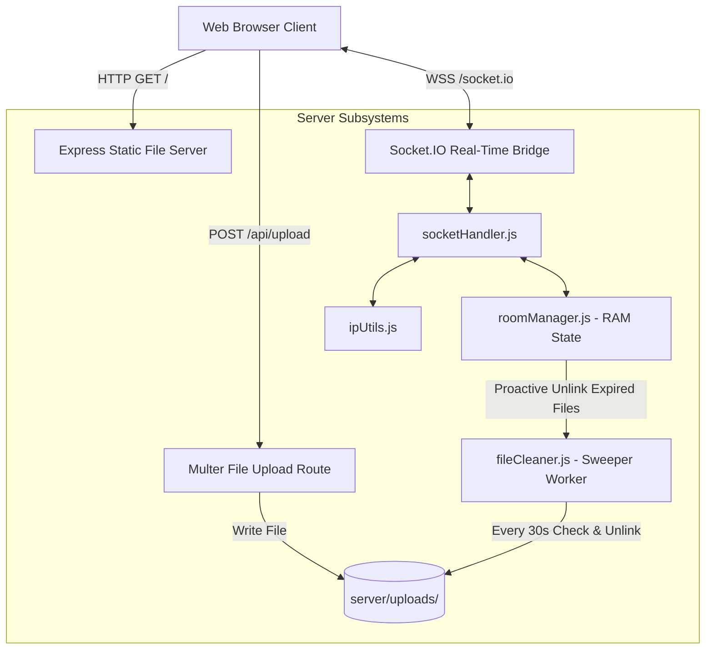
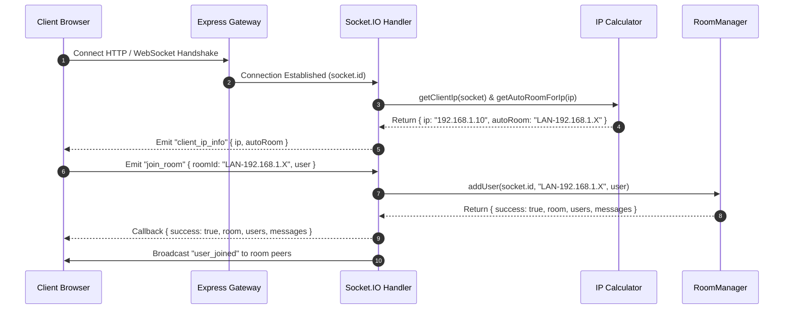
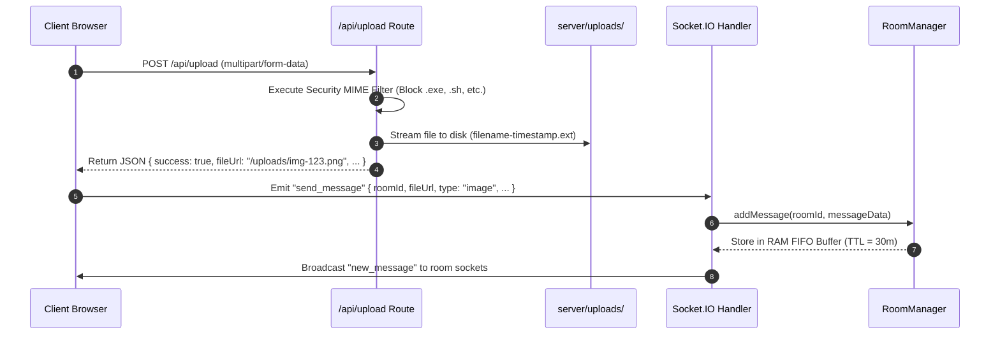
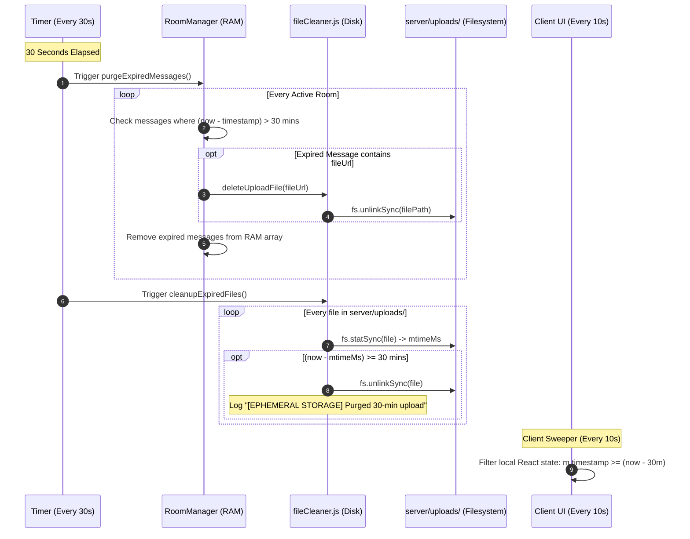
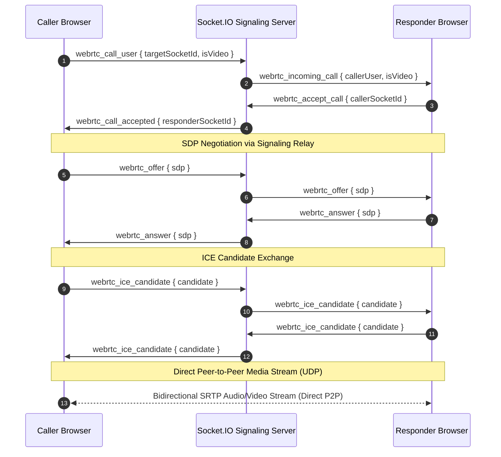

# System Architecture Document
## Project Name: VISION — Ephemeral Network Bridge
**Document Version:** 1.0.0  
**Status:** Approved  
**Author:** DeepMind Core Architecture Team & Lead Systems Architect  

---

## 1. Architectural Philosophy & Principles

VISION is architected around the following foundational principles:
1. **Zero-Database Persistence:** The platform has zero dependencies on relational (PostgreSQL, MySQL) or NoSQL (MongoDB, Redis) databases. All volatile state is maintained exclusively in server RAM and isolated client-side memory.
2. **Deterministic Subnet Routing:** Automatic peer grouping derived algorithmically from IP headers without requiring manual room entry.
3. **Dual-Layer Ephemeral Purge:** Strict 30-minute lifecycle enforcement operating concurrently across in-memory state queues and physical disk storage.
4. **Decoupled P2P Media Streams:** Audio/video media streams flow strictly browser-to-browser via WebRTC UDP; the server acts only as an ultra-lightweight signaling relay.
5. **Unified Monolithic Deployment:** A single Node.js runtime encapsulates the HTTP API, static Single Page Application (SPA) asset serving, WebSockets server, and background garbage collectors.

---

## 2. Technology Stack Selection



---

## 3. High-Level Component Architecture



### 3.1 Subsystem Specifications

#### 1. Express Gateway (`server/index.js`)
- Houses CORS and Helmet configurations.
- Implements IP rate limiting (300 requests / 15 minutes).
- Serves static compiled client assets from `client/dist/`.
- Configures static file serving for `/uploads` with `X-Content-Type-Options: nosniff`.
- Traps missing or purged files with an explicit `404 Not Found` JSON error response to prevent single-page application fallback loops.

#### 2. Socket Event Dispatcher (`server/socketHandler.js`)
- Handles client connection handshakes and extracts client IP descriptors via `ipUtils.js`.
- Dispatches room lifecycle events: `create_room`, `join_room`, `update_room_settings`.
- Dispatches chat operations: `send_message`, `typing`, `toggle_reaction`.
- Serves as the transparent signaling relay for WebRTC: `webrtc_call_user`, `webrtc_offer`, `webrtc_answer`, `webrtc_ice_candidate`, `webrtc_end_call`.

#### 3. In-Memory State Manager (`server/roomManager.js`)
- Maintains volatile state in two native JavaScript `Map` structures:
  - `rooms`: `Map<RoomId, RoomObject>`
  - `socketMap`: `Map<SocketId, { roomId, user }>`
- Implements rolling FIFO queue capped at 200 messages per room.
- Manages cryptographic SHA-256 room password verification via `crypto.timingSafeEqual`.
- Schedules idle room destruction when all users disconnect from custom rooms (10-minute grace period).

#### 4. Subnet IP Calculator (`server/ipUtils.js`)
- Evaluates client IP address strings against IPv4/IPv6 private ranges.
- Computes deterministic room identifiers:
  - Private Class C: `192.168.1.45` $\rightarrow$ `LAN-192.168.1.X`
  - Public Subnet: `103.21.244.12` $\rightarrow$ `IP-103.21.244.X`
  - Local Loopback: `127.0.0.1` / `::1` $\rightarrow$ `LAN-LOCAL-LOOPBACK`

#### 5. Ephemeral Disk Sweeper (`server/fileCleaner.js`)
- Runs a background worker interval every 30 seconds.
- Analyzes `server/uploads/` directory entries using `fs.statSync()`.
- Evaluates file age via `Date.now() - stats.mtimeMs`.
- Unlinks any file where age $\ge$ `30 * 60 * 1000` ms.
- Exposes `deleteUploadFile(fileUrl)` with path-traversal prevention (`path.basename()`).

---

## 4. Detailed Data Flow Diagrams

### 4.1 Subnet Auto-Discovery & Handshake


### 4.2 Ephemeral File Upload & Messaging Flow


### 4.3 30-Minute Dual-Layer Purge Engine


### 4.4 WebRTC Direct Media Calling Flow


---

## 5. Storage & Memory Architecture

### 5.1 RAM Data Structures
The entire server state is held in native V8 Heap structures:

```typescript
interface OperativeUser {
  socketId: string;
  id: string;
  name: string;
  avatar: string;
  color: string;
  device: 'mobile' | 'desktop';
  isHost: boolean;
  joinedAt: number;
}

interface EphemeralMessage {
  id: string;             // UUIDv4
  roomId: string;
  sender: OperativeUser;
  text: string;           // max 10,000 characters
  type: 'text' | 'image' | 'audio' | 'video' | 'file';
  fileUrl: string | null; // e.g. "/uploads/img-1788...png"
  fileName: string | null;
  fileSize: number | null;
  audioDuration: number | null;
  reactions: Record<string, string[]>; // emoji -> array of usernames
  timestamp: number;      // Server epoch timestamp in ms
}

interface VirtualRoom {
  id: string;             // Uppercase alphanumeric (e.g. "LAN-192.168.1.X")
  name: string;
  hasPassword: boolean;
  passwordHash: string | null; // SHA-256 hex digest
  isCustom: boolean;
  isPrivate: boolean;
  maxUsers: number;       // default 50
  createdAt: number;
  hostId: string | null;
  hostName: string | null;
  settings: {
    allowFileUploads: boolean;
    allowCalls: boolean;
    allowVoiceNotes: boolean;
    onlyHostCanPost: boolean;
  };
  users: Map<string, OperativeUser>; // socketId -> OperativeUser
  messages: EphemeralMessage[];      // max 200 items, TTL = 30m
  typingUsers: Set<string>;          // Active typing usernames
}
```

### 5.2 Filesystem Organization
All uploaded media resides in a single, un-nested directory:
```
server/
  uploads/
    voice-note-1788705696072-141312420.webm   <-- Deleted at 30 mins
    cyber_schematic-1788718283207.png         <-- Deleted at 30 mins
    project_manifest-1788729302194.pdf        <-- Deleted at 30 mins
```

---

## 6. Security Architecture & Threat Modeling

| Threat Vector | Vulnerability Type | Mitigation Strategy in VISION |
| :--- | :--- | :--- |
| **Path Traversal Attacks** | Directory Traversal (`../../`) | `fileCleaner.deleteUploadFile()` strictly applies `path.basename(fileUrl)` and verifies that `path.normalize(target).startsWith(UPLOADS_DIR)`. |
| **Remote Code Execution (RCE)** | Unrestricted File Upload | Blocked extension set (`.exe`, `.sh`, `.php`, `.js`, etc.) checked inside Multer `fileFilter`. Static files served with `nosniff`. |
| **Password Timing Attacks** | Side-Channel Timing Leak | Passwords compared via `crypto.timingSafeEqual(bufA, bufB)` to guarantee constant-time execution. |
| **Denial of Service (DoS)** | Socket / HTTP Flooding | Rate-limiting middleware caps `/api/` to 300 req/15m. File uploads capped at 50MB. Messages capped at 10,000 characters. In-memory message queues capped at 200 items. |
| **Data Scraping & Telemetry** | Digital Footprint | Zero databases, zero session cookies, zero external trackers, IP subnet masking on WAN addresses. |

---

## 7. Scalability & Deployment Architecture

### 7.1 Single-Node Architecture (Default)
In default deployment, VISION operates as a high-density, low-footprint single Docker container:
- Memory footprint: ~85MB RAM idle, ~180MB RAM under peak load.
- Concurrency: Easily supports up to 10,000 concurrent WebSocket connections on a 1 vCPU / 1GB RAM virtual server.

### 7.2 Multi-Node Horizontal Scaling (Optional Enterprise Expansion)
While VISION is optimized for ad-hoc private networks, scaling across multi-node clusters can be accomplished by:
1. Attaching the `@socket.io/redis-adapter` to distribute pub/sub messaging across nodes.
2. Mounting an ephemeral NFS or shared memory volume for `server/uploads/` with a centralized cleanup worker.
3. Terminating SSL via NGINX or Cloudflare with WebSocket upgrade forwarding.
