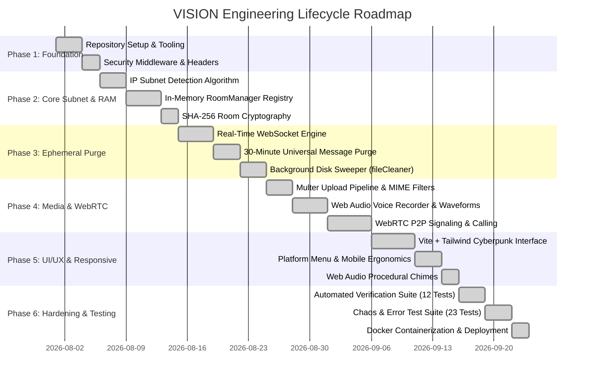
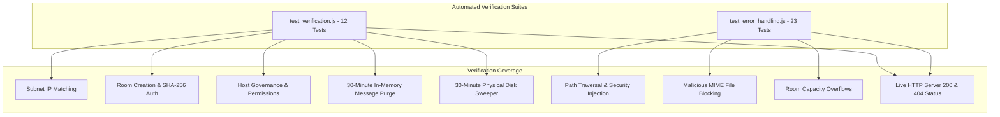

# Development Plan & Engineering Roadmap
## Project Name: VISION — Ephemeral Network Bridge
**Document Version:** 1.0.0  
**Status:** Approved  
**Author:** DeepMind Core Architecture Team & Lead Systems Architect  

---

## 1. Engineering Roadmap Overview

This document translates the requirements from the **PRD**, **SRS**, **Architecture Document**, and **UI/UX Specification** into a structured, six-phase execution roadmap. It defines specific tasks, priority rankings, strict dependencies, milestones, and explicit **Definitions of Done (DoD)** to ensure flawless engineering delivery.



---

## 2. Phase-by-Phase Work Breakdown Structure (WBS)

### Phase 1: Environment & Foundation
- **Task 1.1: Project Scaffolding:** Initialize root project with dual-tier structure (`client/` for Vite/React and `server/` for Node/Express).
- **Task 1.2: Security Middleware Integration:** Configure Helmet HTTP security headers, CORS origin bindings, and Express rate limiting (300 req / 15m).
- **Task 1.3: Unified Server Pipeline:** Establish Express static serving pipeline to route production React build assets from `client/dist/`.

### Phase 2: In-Memory Subnet Engine & Room Management
- **Task 2.1: IP Subnet Calculator (`server/ipUtils.js`):**
  - Implement reverse proxy IP resolution (`trust proxy`).
  - Classify LAN vs. WAN addresses and calculate deterministic subnets (`LAN-192.168.1.X` or `IP-103.21.244.X`).
- **Task 2.2: Room Manager Architecture (`server/roomManager.js`):**
  - Construct native in-memory Maps (`rooms` and `socketMap`).
  - Implement custom room creation with configurable `maxUsers` (default 50).
  - Implement SHA-256 room password hashing and timing-safe equality verification (`crypto.timingSafeEqual`).
  - Implement host governance settings (toggles for file uploads, calls, voice notes, and host-only posting).
  - Implement 10-minute idle room garbage collection for empty custom rooms.

### Phase 3: Real-Time Engine & 30-Minute Ephemeral Purge
- **Task 3.1: Socket.IO Event Engine (`server/socketHandler.js`):**
  - Implement event handlers for `create_room`, `join_room`, `send_message`, `typing`, `toggle_reaction`.
  - Establish rolling in-memory FIFO message queues capped at 200 messages per room.
- **Task 3.2: 30-Minute Universal Message Purge:**
  - Enforce strict 30-minute TTL on all chat messages.
  - Implement 30-second interval in `RoomManager` to purge messages older than 30 minutes from memory.
  - Implement independent 10-second client-side sweep in `SocketContext.jsx`.
- **Task 3.3: 30-Minute Disk File Sweeper (`server/fileCleaner.js`):**
  - Implement background worker scanning `server/uploads/` every 30 seconds.
  - Evaluate file modification time (`stats.mtimeMs`).
  - Unlink any file exceeding 30 minutes (`30 * 60 * 1000 ms`).
  - Implement `deleteUploadFile()` with path-traversal prevention (`path.basename`).
  - Link message expiration directly to physical file deletion.
  - Add explicit `404 Not Found` JSON handler on `/uploads/:file` for missing/purged media.

### Phase 4: Ephemeral Media & WebRTC Audio/Video
- **Task 4.1: Secure Upload Pipeline (`server/routes/upload.js`):**
  - Configure Multer disk storage targeting `server/uploads/`.
  - Implement strict security file filter blocking 18 executable/script extensions (`.exe`, `.bat`, `.sh`, `.php`, etc.).
  - Enforce 50MB single-file size ceiling.
- **Task 4.2: Web Audio Voice Studio (`VoiceRecorder.jsx`):**
  - Utilize `MediaRecorder` API to capture `audio/webm` streams.
  - Render dynamic 12-bar real-time waveform visualizers.
  - Auto-upload recorded notes and dispatch audio message to room.
- **Task 4.3: WebRTC P2P Audio/Video Calling:**
  - Implement signaling channel over Socket.IO (`webrtc_call_user`, `webrtc_offer`, `webrtc_answer`, `webrtc_ice_candidate`, `webrtc_end_call`).
  - Construct fullscreen video viewport (`VideoCallModal.jsx`) with local PIP stream, camera toggle, mic mute, and screen sharing.

### Phase 5: Cyberpunk UI/UX & Responsive Terminal Interface
- **Task 5.1: Terminal Theme & Tailwind Tokens:**
  - Implement obsidian dark theme (`#030508`), neon emerald (`#00ff88`), and cyber cyan accents.
  - Configure monospace typography hierarchy (`JetBrains Mono`).
- **Task 5.2: Responsive Platform Menu & Mobile Ergonomics:**
  - Build consolidated platform functions popover providing thumb access to all platform capabilities.
  - Optimize mobile layout by hiding redundant desktop headers and ensuring minimum 44px touch targets.
- **Task 5.3: Procedural Audio Engine (`utils/sound.js`):**
  - Implement zero-dependency Web Audio API procedural sound synthesizer for message sends, receives, joins, and leaves.
  - Provide global audio mute toggle.

### Phase 6: Hardening, Automated Testing & Containerization
- **Task 6.1: Automated Backend Test Suite (`server/test_verification.js`):**
  - 12 comprehensive unit tests covering subnet detection, password verification, room capacity limits, host settings, 30-minute message purge, 30-minute disk sweep, and live HTTP health.
- **Task 6.2: Chaos & Error Test Suite (`server/test_error_handling.js`):**
  - 23 fault injection tests covering path traversal attacks, room capacity overflow, malformed message payloads, missing disk files, blocked executable uploads, and empty payloads.
- **Task 6.3: Docker Containerization:**
  - Configure multi-stage `Dockerfile` and `docker-compose.yml` for unified single-command production deployment.

---

## 3. Definition of Done (DoD)

A task or phase is considered **Done** only when all of the following criteria are satisfied:

| Quality Dimension | Criteria |
| :--- | :--- |
| **Code Quality** | Clean, modular JavaScript (ES6+) with zero unused variables and proper error boundaries. |
| **Ephemerality Compliance** | Verified that no database tables, user records, or permanent log files are created. |
| **30-Minute TTL Invariant** | Messages in RAM and files on disk are verified to be deleted within 30 seconds of reaching 30-minute age. |
| **Security Invariant** | Path traversal attacks (`../../`) and blocked file uploads (`.exe`, `.bat`) are verified to be rejected. |
| **Test Verification** | 100% of tests in `server/test_verification.js` (12/12) and `server/test_error_handling.js` (23/23) pass with exit code 0. |
| **Build Integrity** | `npm run build` inside `client/` executes cleanly with zero syntax or bundling errors. |
| **Production Runtime** | Unified server serves HTTP, WebSockets, and SPA assets on port 3000 with sub-25ms response times. |

---

## 4. Test Matrix & Verification Protocols



### Execution Commands:
```bash
# 1. Run Core Logic & Ephemeral Purge Verification (12 Tests)
node server/test_verification.js

# 2. Run Comprehensive Security & Error Resilience Suite (23 Tests)
node server/test_error_handling.js
```

---

## 5. Deployment & Runbook Guide

### 5.1 Local Development
```bash
# Start backend server in dev mode
cd server && npm run dev

# Start frontend Vite dev server (in separate terminal)
cd client && npm run dev
```

### 5.2 Production Standalone Build
```bash
# Compile client assets into client/dist/
cd client && npm run build

# Start unified production server
cd ../server && npm start
# Application operational on http://localhost:3000
```

### 5.3 Docker Containerized Deployment
```bash
# Build and run containerized service
docker-compose up -d --build

# Inspect container status
docker-compose ps

# View ephemeral purge logs
docker-compose logs -f
```
