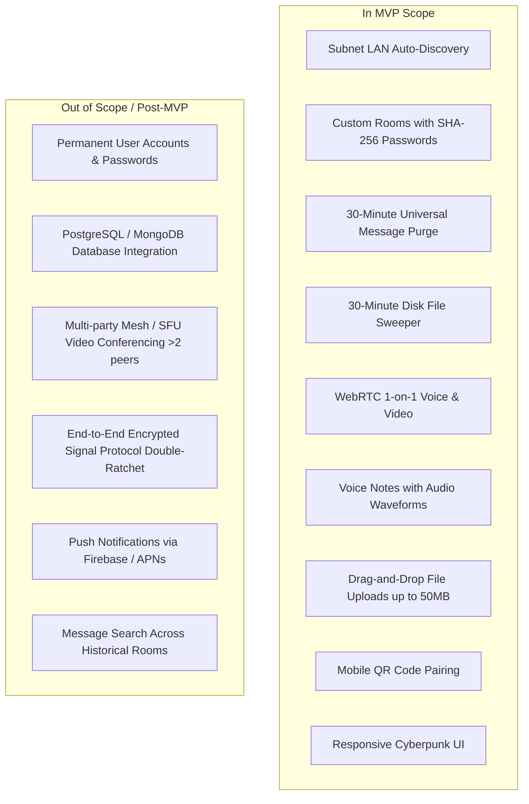

# Product Requirements Document (PRD)
## Project Name: VISION — Ephemeral Network Bridge
**Document Version:** 1.0.0  
**Status:** Approved  
**Author:** DeepMind Core Architecture Team & Lead Systems Architect  
**Classification:** Confidential / Internal Engineering Specification  

---

## 1. Executive Summary

**VISION (Ephemeral Network Bridge)** is a zero-trace, peer-to-peer, real-time communication platform engineered for ad-hoc local and cross-network collaboration. Inspired by lightweight local network messaging utilities, VISION elevates the paradigm by combining:
- **Zero-Configuration Subnet Auto-Discovery:** Devices sharing a local Wi-Fi, LAN, or public subnet automatically form collaborative workspaces without account registration.
- **Custom Cryptographic Rooms:** Users can spin up password-protected, isolated virtual rooms on demand with custom identifiers and QR-code mobile pairing.
- **Strict 30-Minute Universal Ephemeral Purge:** All chat history, shared images, documents, audio voice notes, and system logs are systematically and irreversibly purged from memory and server disk storage after 30 minutes.
- **In-Browser WebRTC Peer-to-Peer Video/Voice Calls:** Direct browser-to-browser media streaming without media relay servers.
- **Cyberpunk / Terminal Aesthetics:** High-contrast, privacy-centric dark interface optimized for desktop workstations and mobile browsers.

VISION requires **zero persistent database storage**, **zero user credential tracking**, and leaves **zero server-side forensic footprint**.

---

## 2. Problem Statement

Modern communication platforms (Slack, Discord, WhatsApp, Telegram, Microsoft Teams) operate on persistent data architectures designed for continuous data retention, behavioral telemetry, and centralized profiling:
1. **Unwanted Persistence & Digital Residue:** Transient conversations (e.g., sharing a one-time API token, a temporary WiFi code, local classroom notes, or a quick debug snippet) remain archived indefinitely across cloud databases and device backups.
2. **Friction of Identity Setup:** Sharing information quickly between colleagues on the same LAN requires mutual account creation, phone number exchange, corporate email invites, or friend requests.
3. **Cross-Device Friction:** Moving a photo, code snippet, or link between a desktop workstation and a personal mobile device on the same desk is plagued by cloud synchronization lag or platform lock-in.
4. **Data Sovereignty & Privacy Concerns:** Centralized providers maintain inspectable logs of message content, IP metadata, and media uploads, exposing users to subpoena, third-party leaks, and data breaches.

**VISION resolves this by serving as an ephemeral bridge**: instant, zero-signup, subnet-aware, and guaranteed to vanish within 30 minutes.

---

## 3. Target Audience & User Personas

| Persona | Archetype | Primary Need | Frustration with Existing Tools |
| :--- | :--- | :--- | :--- |
| **DevOps / Netrunner (Alex)** | Technical Specialist | Rapidly share API keys, SSH configs, logs, and tokens between machines or colleagues. | Permanent chat logs create compliance and security exposure. |
| **LAN / Office Collaborator (Sarah)** | Team Member | Instant file/text sharing with teammates in the same physical office without adding them to personal accounts. | Slow corporate onboarding, restrictive enterprise firewalls. |
| **Cross-Device Power User (Marcus)** | Multi-Device User | Drop photos or audio notes from phone to laptop without email self-sending or cloud drive sync. | Requires Bluetooth pairing or cloud authentication friction. |
| **Privacy Advocate (Elena)** | Anonymous Operative | Discuss sensitive matters with zero digital footprint, zero metadata harvesting, and guaranteed auto-purge. | Centralized metadata tracking and lack of true ephemeral storage guarantees. |

---

## 4. Product Vision & Goals

### 4.1 Vision Statement
To establish the world's most accessible, zero-friction, and genuinely ephemeral real-time collaboration environment—where communication exists only in the present moment and leaves zero trace in history.

### 4.2 Core Product Goals
- **G-1: Zero-Signup Access:** Users access fully functional real-time communications within 500 milliseconds of navigating to the URL.
- **G-2: Deterministic Subnet Grouping:** Users on the same subnet connect automatically without coordinating room names.
- **G-3: Absolute Ephemerality:** 100% of all chat messages and physically uploaded media are wiped from memory and filesystem storage after exactly 30 minutes.
- **G-4: Sub-20ms Message Latency:** Real-time text delivery and typing indicators operating over lightweight WebSocket frames.
- **G-5: Peer-to-Peer Privacy:** Voice and video communications routed directly peer-to-peer via WebRTC without intermediary audio/video recording.

---

## 5. Core Key Performance Indicators (KPIs) & Success Metrics

| Metric | Target | Measurement Method |
| :--- | :--- | :--- |
| **Time-to-Message (TTM)** | `< 3 seconds` | From URL load to first sent message (Zero-Auth mode). |
| **Message Delivery Latency** | `< 25 ms` | Time delta between `send_message` emission and peer receipt on LAN. |
| **Storage Leakage Rate** | `0.00%` | Automated disk auditor checking for files older than 30m in `server/uploads/`. |
| **Ephemeral Memory Ceiling** | `< 250 MB` | Peak RSS memory consumption under 200 concurrent active chat rooms. |
| **WebRTC Connection Success**| `> 95%` on LAN | Direct peer ICE candidate connection rate without TURN fallback. |
| **Platform Crash Rate** | `< 0.01%` | Unhandled process exceptions per 100,000 socket events. |

---

## 6. Detailed Feature Breakdown & Scope

### 6.1 Feature 1: Subnet Auto-Discovery (Default Room)
- **Description:** Server inspects the incoming client IP (handling reverse proxies via `trust proxy` headers) and computes a deterministic subnet room identifier (e.g., `LAN-192.168.1.X` or `IP-103.21.244.X`).
- **Behavior:** All devices connected to the same local router or subnet are immediately joined into a common shared room.
- **No Configuration:** No prompts, room creation screens, or account credentials required.

### 6.2 Feature 2: Custom Protected Rooms
- **Description:** Users can spin up isolated virtual rooms with custom alphanumeric IDs (e.g., `QUANTUM-OPS-01`).
- **Security:** Optional SHA-256 password protection. Timing-safe password verification prevents side-channel timing attacks.
- **Sharing Suite:**
  - One-click invite link copying with embedded hashtag fragment `#room=...&pwd=...`.
  - Dynamic in-browser Canvas QR Code generator for instantaneous smartphone camera pairing.
  - Room privacy toggle (Private vs. Public listing).
  - Maximum user limit governance (`maxUsers`, default: 50).

### 6.3 Feature 3: Real-Time Messaging & Presence Engine
- **Engine:** WebSocket engine built on Socket.IO with WebSocket and Polling fallbacks.
- **Typing Indicators:** Broadcasts live typing presence with a 1500ms auto-decay timer.
- **Operative Identity:** Customizable pseudonym, role tag (e.g., `NETRUNNER`), status tagline, avatar icon, and custom color accents stored strictly in client `localStorage`.
- **Markdown & Code Blocks:** Automatic URL detection, markdown formatting, syntax code blocks with one-click copy button.
- **Emoji Reactions:** In-place message emoji reaction bars (`👍`, `❤️`, `🔥`, `😂`, `🎉`, `🚀`, `👀`).
- **Audio Chimes:** Procedural Web Audio API sound synthesis (message send, receive, user join, user leave) with global mute control.

### 6.4 Feature 4: Strict 30-Minute Universal Ephemeral Purge
- **Message Purge:** In-memory message buffers in `RoomManager` prune all messages older than 30 minutes (`30 * 60 * 1000 ms`). The client-side UI executes an independent 10-second sweep.
- **Physical Disk Sweeper:** Background disk cleaner (`fileCleaner.js`) scans `server/uploads/` every 30 seconds. Any media file older than 30 minutes is unlinked via `fs.unlinkSync`.
- **Proactive Unlink:** When an expired message containing a `fileUrl` is removed from room history, its corresponding physical file on disk is immediately deleted.
- **Graceful Fallback:** If an image or voice note is purged while open in an inactive browser tab, the client renders an informative ephemeral badge: `⏱️ File expired (30m Ephemeral Purge)`.

### 6.5 Feature 5: WebRTC Audio/Video Calling
- **Architecture:** Browser-native WebRTC `RTCPeerConnection` utilizing Socket.IO strictly as the SDP offer/answer/ICE candidate signaling channel.
- **Capabilities:** 1-on-1 real-time audio and video calling with remote stream rendering, local camera preview, microphone mute toggle, and video toggle.
- **Zero Intermediary:** Media streams travel directly peer-to-peer over UDP; the server never receives or buffers audio/video packets.

### 6.6 Feature 6: In-Browser Live Voice Studio
- **Capture:** Native `MediaRecorder` API capturing high-fidelity `audio/webm` streams.
- **Visualizer:** Live animated waveform meters during both recording and playback.
- **Instant Upload & Purge:** Captured voice notes upload to ephemeral storage, dispatch to the room, and auto-delete after 30 minutes.

### 6.7 Feature 7: File & Image Dropzone
- **Upload Engine:** Multer storage engine supporting up to 50MB per file.
- **MIME Security Filter:** Strict rejection of executable and script binaries (`.exe`, `.bat`, `.cmd`, `.sh`, `.ps1`, `.vbs`, `.js`, `.mjs`, `.php`, `.html`, `.hta`, `.jar`, `.asp`).
- **Lightbox:** Full-screen zoomable lightbox viewer for shared images.

### 6.8 Feature 8: Cyberpunk / Terminal User Interface
- **Design System:** Obsidian dark theme (`#030508`), neon emerald (`#00ff88`), cyber cyan (`#00f0ff`), neon crimson (`#ff3366`), amber gold (`#ffb700`).
- **Typography:** High-legibility monospace fonts (`JetBrains Mono`, `Fira Code`, monospace fallbacks).
- **Responsive Layout:** Adaptive desktop two-column view and sleek mobile view featuring a consolidated bottom action bar and compact platform functions menu.

---

## 7. MVP Scope vs. Out-of-Scope

### 7.1 Explicitly Out of Scope (Guiding Principles)
- **No Databases:** No SQL or NoSQL database will ever be provisioned for chat history or user profiles.
- **No Analytics / Telemetry:** No Google Analytics, Mixpanel, or third-party tracking cookies.
- **No Permanent Media Storage:** No AWS S3, Google Cloud Storage, or MinIO persistence. All storage is local and wiped at 30 minutes.

---

## 8. User Stories & Acceptance Criteria

### US-01: Instant Subnet Collaboration
- **As a** developer connected to an office Wi-Fi network,  
- **I want to** open the application and immediately see other active colleagues on the same network,  
- **So that** we can exchange code snippets without creating accounts or exchanging handles.
- **Acceptance Criteria:**
  - *Given* two devices connected to the same subnet (e.g. `192.168.1.X`),
  - *When* both users open the root URL in their browsers,
  - *Then* both users are automatically placed into the same room (e.g., `LAN-192.168.1.X`) within 1 second.

### US-02: Isolated Private Room Creation
- **As an** operative managing a private discussion,  
- **I want to** generate a custom room ID with a secret passphrase,  
- **So that** only people with the link and passphrase can enter.
- **Acceptance Criteria:**
  - *Given* an operative creates room `STEALTH-404` with password `cipherKey99`,
  - *When* another user attempts to join without the password,
  - *Then* access is denied with a `requiresPassword` challenge.
  - *When* the user enters `cipherKey99`,
  - *Then* they enter the room and view live room participants.

### US-03: Strict 30-Minute File and Message Auto-Purge
- **As a** privacy-conscious user sharing sensitive documents or credentials,  
- **I want** all messages and shared files to be permanently deleted after 30 minutes,  
- **So that** no historical records exist on the server disk or in chat memory.
- **Acceptance Criteria:**
  - *Given* a user sends a message and uploads a photo at `T = 0m`,
  - *When* the clock reaches `T = 30m 01s`,
  - *Then* the message disappears from client chat streams,
  - *And* `fs.existsSync(filePath)` returns `false` on the server disk,
  - *And* any HTTP GET to the media URL returns `404 Not Found`.

### US-04: Peer-to-Peer Audio/Video Call
- **As a** user in an active room,  
- **I want to** initiate a direct 1-on-1 video or voice call with a peer,  
- **So that** we can talk securely without our audio/video touching a cloud recording server.
- **Acceptance Criteria:**
  - *Given* two peers in the same room,
  - *When* User A clicks "Video Call" on User B,
  - *Then* User B receives an incoming call modal with accept/reject buttons.
  - *When* User B accepts,
  - *Then* WebRTC peer connection establishes and displays bidirectional video streams within 2 seconds.

---

## 9. Assumptions & Technical Dependencies

1. **Browser Modernity:** Target browsers support modern ES6+, WebSockets, WebRTC (`RTCPeerConnection`), and `MediaRecorder` (Chrome 80+, Firefox 75+, Safari 14.1+, Edge 80+).
2. **Network Topology:** Direct WebRTC connectivity relies on LAN environments or standard STUN servers. Symmetrical NAT environments requiring TURN relays may require TURN provisioning in enterprise deployments.
3. **Storage Availability:** Host server contains sufficient temporary RAM and local disk space to handle concurrent uploads up to 50MB each prior to their 30-minute purge.
4. **Node.js Environment:** Host server runs Node.js v18.0.0 or higher.

---

## 10. Risk Assessment & Mitigation Strategy

| Risk ID | Risk Description | Severity | Likelihood | Mitigation Strategy |
| :--- | :--- | :---: | :---: | :--- |
| **R-01** | Disk exhaustion via malicious mass file uploads. | High | Medium | Enforce 50MB single-file ceiling, IP rate limiting (300 req/15m), and background sweep interval running every 30 seconds. |
| **R-02** | Malicious executable upload and execution (.exe, .sh, .php). | Critical | Medium | Hardened Multer `fileFilter` blocking 18 executable extensions; static directory configured with `X-Content-Type-Options: nosniff`. |
| **R-03** | WebRTC signaling failure behind strict corporate firewalls. | Medium | High | Support STUN candidate discovery; provide clear in-app signaling failure notifications. |
| **R-04** | Client clock drift causing premature or delayed message purging. | Low | Low | Server timestamp (`Date.now()`) serves as the authoritative source of truth for message and file TTL evaluation. |
| **R-05** | Memory leak from abandoned in-memory custom rooms. | Medium | Low | Background garbage collector in `RoomManager` purges empty custom rooms after 10 minutes of zero active sockets. |
