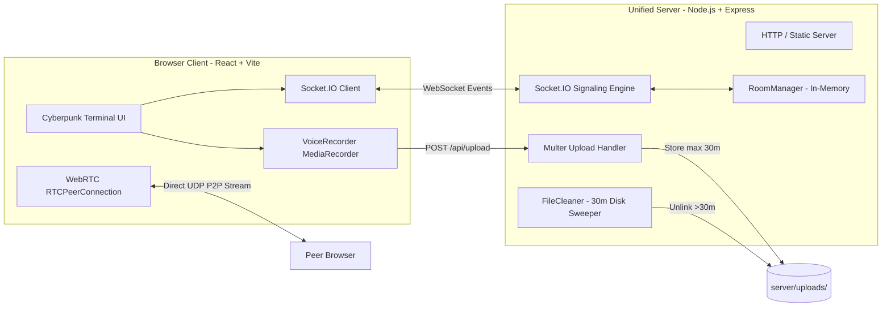

# Software Requirements Specification (SRS)
## Project Name: VISION — Ephemeral Network Bridge
**Standard:** IEEE 830-1998 Compliant Specification  
**Version:** 1.0.0  
**Status:** Approved  
**Author:** DeepMind Core Architecture Team & Lead Systems Architect  

---

## 1. Introduction

### 1.1 Purpose
This document specifies the software requirements for **VISION (Ephemeral Network Bridge)**. It serves as the authoritative contract between product management, software engineering, quality assurance, and security auditing teams.

### 1.2 Scope
VISION is a lightweight, zero-trace, real-time communication platform providing subnet auto-discovery, custom ephemeral chat rooms, 30-minute universal message and media auto-purging, peer-to-peer WebRTC voice/video calling, and voice note recording. It operates without persistent database systems, persistent user credentials, or server-side logging.

### 1.3 Definitions, Acronyms, and Abbreviations
- **SRS:** Software Requirements Specification
- **Ephemeral Storage:** Volatile data storage that exists temporarily in server RAM or disk, guaranteed to be unlinked after a fixed time-to-live (TTL).
- **TTL (Time-To-Live):** The 30-minute lifespan allocated to messages and uploaded media files before permanent purge.
- **WebRTC:** Web Real-Time Communication (peer-to-peer audio, video, and data).
- **SDP:** Session Description Protocol used in WebRTC peer connection negotiation.
- **ICE:** Interactive Connectivity Establishment framework for NAT traversal.
- **Subnet ID:** A deterministic string derived from an operative's network IP (e.g. `LAN-192.168.1.X` or `IP-103.21.244.X`).
- **Host:** The operative who initiated the creation of a custom room and holds administrative governance over room settings.

---

## 2. Overall Description

### 2.1 Product Perspective
VISION operates as a self-contained, unified Node.js/Express and React application. It acts as an autonomous network bridge running inside private networks, on public servers, or within containerized Docker environments.

### 2.2 User Classes & Permissions Matrix

| User Role | Description | Permissions |
| :--- | :--- | :--- |
| **Anonymous Operative** | Default user connecting to local network auto-room. | Send/receive messages, upload allowed files, record voice notes, initiate/receive WebRTC calls, react with emojis. |
| **Room Host (Admin)** | Operative who created a custom room. | All operative permissions **PLUS**: rename room, change room password, adjust `maxUsers`, toggle `onlyHostCanPost`, toggle `allowFileUploads`, toggle `allowCalls`, toggle `allowVoiceNotes`. |
| **Guest / Participant** | Member inside a custom room created by another host. | Subject to host-enforced permissions (e.g. muted if `onlyHostCanPost` is enabled; uploads blocked if `allowFileUploads` is false). |

---

## 3. Specific Functional Requirements

### 3.1 Subnet Detection & Network Routing (FR-1)
- **FR-1.1:** Upon initial socket handshake, the server shall extract the client IP address from `socket.handshake.address`, respecting `x-forwarded-for` headers when behind reverse proxies.
- **FR-1.2:** The system shall determine whether the IP is a private LAN address (`10.x.x.x`, `172.16-31.x.x`, `192.168.x.x`, `127.0.0.1`, or `::1`).
- **FR-1.3:** For private LAN addresses, the system shall group users by `/24` subnet masking, generating a room identifier formatted as `LAN-<SubnetPrefix>.X`.
- **FR-1.4:** For public WAN addresses, the system shall mask the host octet to preserve privacy, formatting the room identifier as `IP-<PublicSubnet>.X`.
- **FR-1.5:** The server shall emit `client_ip_info` to the client upon connection containing the IP string, detected network type, and auto-room descriptor.

### 3.2 Custom Room Lifecycle & Governance (FR-2)
- **FR-2.1:** Any operative can dispatch a `create_room` socket request with parameters: `roomId`, `name`, optional `password`, `isPrivate`, `maxUsers` (default: 50, max: 200), and `settings`.
- **FR-2.2:** The server shall sanitize `roomId` by converting to uppercase and stripping non-alphanumeric characters except hyphens and underscores (`[^a-zA-Z0-9_-]`).
- **FR-2.3:** If a room with the requested ID already exists, the server shall return `{ success: false, error: 'Room ID already exists...' }`.
- **FR-2.4:** If a room password is provided, the server shall compute a salted SHA-256 hash using `crypto.createHash('sha256')`. Plaintext passwords shall never be persisted in memory or logs.
- **FR-2.5:** Password verification shall use `crypto.timingSafeEqual` over hex buffer digests to eliminate side-channel timing attacks.
- **FR-2.6:** Room settings updates via `update_room_settings` shall be strictly restricted to the socket ID matching `room.hostId`. Unauthorized requests shall be rejected with `{ success: false, error: 'Only the room host can modify settings.' }`.
- **FR-2.7:** When all users disconnect from a custom room, the server shall schedule a 10-minute idle destruction timer. If the room remains empty after 10 minutes, the room and any associated in-memory messages shall be deleted.

### 3.3 Ephemeral Messaging Engine (FR-3)
- **FR-3.1:** The server shall accept `send_message` events containing: `roomId`, `text`, `type` (`text|image|audio|video|file`), `fileUrl`, `fileName`, `fileSize`, `audioDuration`.
- **FR-3.2:** Text payloads shall be sanitized and bounded to a maximum length of 10,000 characters.
- **FR-3.3:** The server shall generate a unique UUIDv4 identifier (`crypto.randomUUID()`) and authoritative server timestamp (`Date.now()`) for each message.
- **FR-3.4:** The message shall be cached in `room.messages` (bounded to a rolling FIFO queue of 200 messages per room).
- **FR-3.5:** The server shall broadcast the normalized message object to all sockets subscribed to `roomId` via `io.to(roomId).emit('new_message', message)`.
- **FR-3.6:** If `room.settings.onlyHostCanPost` is enabled, messages from non-host sockets shall be rejected with `{ success: false, error: 'Only the room host can post messages in this room.' }`.

### 3.4 30-Minute Universal Ephemeral Purge (FR-4)
- **FR-4.1:** All chat messages (text, media, audio notes, system notifications) shall have an immutable TTL of 30 minutes (`1,800,000 ms`).
- **FR-4.2:** The server-side `RoomManager` shall execute `purgeExpiredMessages()` every 30 seconds:
  - Iterates through all active rooms.
  - Filters out any message where `now - message.timestamp >= 30 * 60 * 1000`.
  - For any filtered message containing a `fileUrl`, triggers immediate physical disk deletion via `deleteUploadFile(fileUrl)`.
- **FR-4.3:** The background disk cleaner (`fileCleaner.js`) shall run immediately upon server boot and repeat every 30 seconds:
  - Reads `server/uploads/` directory.
  - Inspects `stats.mtimeMs` for every file.
  - If `now - stats.mtimeMs >= 30 * 60 * 1000`, the file is unlinked immediately via `fs.unlinkSync`.
- **FR-4.4:** The client-side `SocketContext` shall execute an independent memory purge every 10 seconds, eliminating messages with timestamps older than 30 minutes from the React UI state.
- **FR-4.5:** If a client attempts an HTTP GET request for a purged file (`/uploads/<filename>`), the server shall respond with `404 Not Found` JSON `{ success: false, error: 'File expired or not found' }` rather than serving the SPA fallback HTML.

### 3.5 Media & Voice Note Upload System (FR-5)
- **FR-5.1:** The server shall provide `POST /api/upload` accepting `multipart/form-data` with a single file field `file`.
- **FR-5.2:** Uploads shall be restricted to a maximum size of 50 MB (`50 * 1024 * 1024` bytes).
- **FR-5.3:** The server shall execute a security file filter blocking files matching extensions:
  `.exe`, `.bat`, `.cmd`, `.sh`, `.ps1`, `.vbs`, `.js`, `.mjs`, `.html`, `.htm`, `.php`, `.phtml`, `.shtml`, `.hta`, `.jar`, `.jsp`, `.asp`, `.aspx`.
- **FR-5.4:** Stored filenames shall be sanitized into alphanumeric strings with unique timestamp suffixes: `<cleanName>-<timestamp>-<random><ext>`.
- **FR-5.5:** Static upload directory serving shall mandate the `X-Content-Type-Options: nosniff` header.

### 3.6 WebRTC Peer-to-Peer Calling (FR-6)
- **FR-6.1:** The server shall act as a signaling proxy for the following WebSockets events:
  - `webrtc_call_user`: Dispatches incoming call notification with caller metadata and `isVideo` flag to `targetSocketId`.
  - `webrtc_accept_call`: Notifies caller that call was accepted.
  - `webrtc_reject_call`: Notifies caller that call was declined.
  - `webrtc_offer`: Relays caller SDP offer to target socket.
  - `webrtc_answer`: Relays responder SDP answer to caller socket.
  - `webrtc_ice_candidate`: Relays candidate network routing options.
  - `webrtc_end_call`: Terminates the peer session and stops hardware tracks.
- **FR-6.2:** The server shall never inspect, proxy, or store audio/video data packets. All RTP/RTCP media streams must flow directly peer-to-peer.
- **FR-6.3:** When a socket disconnects, any active WebRTC calls involving that socket shall automatically emit `webrtc_call_ended`.

---

## 4. Business Rules

- **BR-1 (Zero Persistence Invariant):** The system shall never write message text, sender details, room passwords, or connection telemetry to permanent database tables or disk log files.
- **BR-2 (Absolute TTL Invariant):** No message or uploaded file shall survive past 30 minutes under any circumstance.
- **BR-3 (Host Primacy Rule):** Only the creator of a custom room may alter room configuration parameters. When the host leaves, the room remains subject to the last configured settings.
- **BR-4 (Path Traversal Prohibition):** Any file manipulation function that accepts external path strings must resolve strictly inside `server/uploads/` via `path.basename()` and path prefix normalization.

---

## 5. Non-Functional Requirements (NFRs)

### 5.1 Performance Requirements
- **NFR-1.1 (Message Latency):** WebSocket message delivery between clients on the same LAN shall not exceed 25ms under 99th percentile conditions.
- **NFR-1.2 (Cold Boot Time):** The unified Node.js server shall start and bind to port 3000 in under 1.5 seconds on standard hardware.
- **NFR-1.3 (Memory Efficiency):** The Node.js process shall maintain RSS memory below 150MB when servicing 50 simultaneous chat rooms with active users.

### 5.2 Security & Privacy Requirements
- **NFR-2.1 (HTTP Security Headers):** Express shall utilize Helmet middleware to enforce secure HTTP headers.
- **NFR-2.2 (Rate Limiting):** API endpoints under `/api/` shall be throttled to a maximum of 300 requests per 15-minute window per IP.
- **NFR-2.3 (CORS Lockdown):** Socket.IO and Express CORS shall support explicit origin whitelisting in production configurations.
- **NFR-2.4 (No Directory Listing):** Direct browsing of the `/uploads/` directory shall be strictly prohibited; only direct file paths are accessible.

### 5.3 Reliability & Availability
- **NFR-3.1 (Auto-Reconnection):** The client Socket.IO instance shall implement exponential backoff reconnection up to 15 attempts.
- **NFR-3.2 (Disk Purge Resilience):** If a file in `server/uploads/` is locked or missing during a purge cycle, the file cleaner shall catch the error, log a warning, and continue without throwing an unhandled exception.

---

## 6. Input Validation & Error Handling Matrix

| Endpoint / Event | Input Parameter | Validation Rule | Error Response |
| :--- | :--- | :--- | :--- |
| `create_room` | `roomId` | String, 1–64 characters, `[a-zA-Z0-9_-]` | `{ success: false, error: 'Room ID is required' }` |
| `create_room` | `maxUsers` | Integer between 2 and 200 | Defaults to 50 if invalid |
| `join_room` | `password` | SHA-256 matched against stored hash | `{ success: false, error: 'Incorrect room password', requiresPassword: true }` |
| `join_room` | Capacity | Current user count `< maxUsers` | `{ success: false, error: 'Room is full' }` |
| `send_message` | `text` | String, length `<= 10000` | Sliced at 10,000 characters |
| `send_message` | `type` | Must match `['text', 'image', 'audio', 'video', 'file']` | Defaults to `'text'` |
| `send_message` | `fileUrl` | Must be a string starting with `/uploads/` | Set to `null` if invalid |
| `POST /api/upload` | File extension | Cannot match 18 blocked extensions | `400 Bad Request` `{ error: 'This file format is restricted for platform security.' }` |
| `POST /api/upload` | File payload | Must exist in `req.file` | `400 Bad Request` `{ error: 'No file provided' }` |
| `GET /uploads/:file` | Path | Must exist in `server/uploads/` | `404 Not Found` `{ error: 'File expired or not found' }` |

---

## 7. Verification & Acceptance Criteria Matrix

| Req ID | Description | Test Verification Procedure | Pass Criteria |
| :---: | :--- | :--- | :--- |
| **TC-01** | Subnet Mapping | Pass LAN IP `192.168.1.45` to `getAutoRoomForIp()` | Returns `LAN-192.168.1.X` room ID |
| **TC-02** | Password Hash | Provide password `key123` to room creation, verify `passwordHash` length | Exactly 64 hex characters (SHA-256) |
| **TC-03** | Room Full | Join room with `maxUsers = 2` with 3rd user | 3rd join returns `{ success: false, error: 'Room is full' }` |
| **TC-04** | Host Privileges | Attempt `update_room_settings` from non-host socket ID | Rejection with `Only the room host can modify settings` |
| **TC-05** | 30m Message Purge | Insert message with timestamp `Date.now() - 31 * 60 * 1000`, run `getMessages()` | Expired message is omitted from results |
| **TC-06** | 30m Disk Sweeper | Create disk file with `mtime` 32m ago, call `cleanupExpiredFiles()` | File is physically deleted from `server/uploads/` |
| **TC-07** | Expired File Unlink | Insert image message with 35m timestamp, call `purgeExpiredMessages()` | Associated file on disk is deleted |
| **TC-08** | Malicious Upload | Send `multipart/form-data` with filename `trojan.exe` to `POST /api/upload` | HTTP 400 with security restriction error |
| **TC-09** | Path Traversal | Call `deleteUploadFile('../../server.js')` | Returns `false`; target file is untouched |
| **TC-10** | 404 on Purged Upload | HTTP GET `http://localhost:3000/uploads/missing.png` | Returns HTTP 404 JSON, NOT single-page `index.html` |
