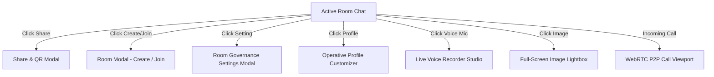

# UI/UX Design & Experience Specification
## Project Name: VISION — Ephemeral Network Bridge
**Document Version:** 1.0.0  
**Status:** Approved  
**Author:** DeepMind Core Architecture Team & Lead Systems Architect  

---

## 1. Design Vision & Cyberpunk Aesthetic

VISION employs a **Stealth Ephemeral / Cyberpunk Terminal** visual language. The interface reflects the aesthetic of an advanced tactical operating console—high-contrast, dark-mode first, laser-focused, devoid of corporate fluff, and emphasizing zero-trace security.

### 1.1 Core Design Pillars
1. **Zero-Latency Visual Feedback:** Every interaction (typing, reaction, send, join) produces immediate, crisp micro-animations and optional procedural audio chimes.
2. **High-Contrast Legibility:** Deep blacks paired with vivid neon emerald, cyber cyan, and electric crimson accents ensure readability in both dimly lit terminal workstations and outdoor mobile environments.
3. **Information Density without Clutter:** Dense technical metadata (IP subnet, ping status, duration, file sizes) presented in sleek, mono-spaced badges.
4. **Mobile Ergonomics:** On handheld devices, redundant top headers are minimized, shifting critical controls to bottom thumb-zones through a unified platform menu.

---

## 2. Design System & Style Tokens

### 2.1 Color Palette

```
/* Primary Surfaces & Backgrounds */
--bg-void:        #030508;   /* Deepest root background */
--bg-surface:     #05080f;   /* Input bar & secondary panels */
--bg-card:        #080d17;   /* Message bubbles, cards, modals */
--bg-elevated:    #0d1524;   /* Outgoing message bubble, active items */
--border-subtle:  #161f30;   /* Standard card & divider border */
--border-focus:   #1a263d;   /* Input borders & active highlights */

/* Neon Signal Accents */
--signal-emerald: #00ff88;   /* Primary action, success, online status, send */
--signal-cyan:    #00f0ff;   /* Secondary action, hyperlinks, create room */
--signal-crimson: #ff3366;   /* Recording beacon, destructive actions, leave */
--signal-amber:   #ffb700;   /* Locked room indicator, passwords, warnings */
--signal-indigo:  #6366f1;   /* System bots, administrative badges */
--signal-violet:  #a855f7;   /* Members presence, calls */

/* Typography Grayscale */
--text-primary:   #f4f4f5;   /* Crisp white text (zinc-100) */
--text-secondary: #a1a1aa;   /* Muted metadata (zinc-400) */
--text-tertiary:  #71717a;   /* Subtle timestamps (zinc-500) */
```

### 2.2 Typography Hierarchy

VISION utilizes a strict monospace-primary typography hierarchy:

| Style Class | Font Family | Size | Weight | Line Height | Usage |
| :--- | :--- | :--- | :--- | :--- | :--- |
| **Display Header** | `JetBrains Mono`, monospace | 18px / 1.125rem | 800 (Extrabold) | 1.3 | Modal titles, room headers |
| **Section Header** | `JetBrains Mono`, monospace | 14px / 0.875rem | 700 (Bold) | 1.4 | Welcome banners, card titles |
| **Body / Message** | `JetBrains Mono`, monospace | 12px / 0.75rem | 400 (Regular) | 1.6 | Chat message stream, inputs |
| **Metadata / Badge**| `JetBrains Mono`, monospace | 10px / 0.625rem | 600 (Semibold) | 1.2 | Timestamps, file sizes, role tags |
| **Code Block** | `JetBrains Mono`, monospace | 11px / 0.6875rem | 500 (Medium) | 1.5 | Multi-line code snippets |

---

## 3. Screen Layout & Component Structure

```
+---------------------------------------------------------------------------------+
| HEADER BAR: [ø] VISION | [LAN-192.168.1.X Beacon] | [Users: 4] | [Mute] | [Menu] |
+---------------------------------------+-----------------------------------------+
| MAIN CHAT STREAM                      | COLLAPSIBLE SIDEBAR / DRAWER            |
|                                       |                                         |
| [Welcome to LAN-192.168.1.X]          | OPERATIVE ROSTER (4 Active)             |
| [Share] [Create Room] [Profile]       |                                         |
|                                       | * [User] Commander Host (Admin, Desktop)|
| * System: Operative joined (11:00)    |   [Call] [Video]                        |
|                                       | * [User] Netrunner_99 (Mobile)          |
| * Peer: Let's test the endpoint       |   [Call] [Video]                        |
|                                       | * [User] Ghost_Cipher (Desktop)         |
| * You: Verified. Here is the config   |                                         |
|   +---------------------------------+ |                                         |
|   | const token = 'x891-ephemeral'; | |                                         |
|   +---------------------------------+ |                                         |
|                                       |                                         |
| * Peer: [Audio Note |> === 0:08]      |                                         |
|                                       |                                         |
| * Typing: Netrunner_99 is typing...   |                                         |
+---------------------------------------+-----------------------------------------+
| INPUT CONSOLE:                                                                  |
| [Attach File] [Emoji] | [ Type a message or code... ] | [Menu] [Mic / Send]     |
+---------------------------------------------------------------------------------+
```

### 3.1 Component Specifications

#### 1. Header Navigation (`Header.jsx`)
- **Left:** Brand badge `[ ø ] VISION` with neon glow, and dynamic room name label.
- **Center:** Subnet status beacon showing live connection indicator (pulsing green dot for LAN, cyan for WAN).
- **Right:**
  - Active Operative counter with quick-open drawer trigger.
  - Procedural sound FX toggle (`Volume2` / `VolumeX`).
  - Mobile menu toggle button.

#### 2. Welcome Action Suite (`ChatArea.jsx`)
Displayed at the head of every chat session:
- **Share Card:** Opens modal with 1-click room URL copying and dynamic QR code.
- **Create Room Card:** Opens room generator modal.
- **Setting / Profile Card:** Context-aware; renders "Room Settings" for Host, or "Profile Customizer" for participants.
- **Leave Room Card:** Renders only inside custom rooms, allowing immediate return to the default local Wi-Fi room.

#### 3. Message Bubble Architecture (`MessageItem.jsx`)
- **Incoming Messages (Left-Aligned):** Dark slate surface (`#080d17`), subtle border (`#151f33`), rounded corners with flat top-left anchor.
- **Outgoing Messages (Right-Aligned):** Deep navy surface (`#0d1524`), cyan/indigo border (`#1d3557`), rounded corners with flat top-right anchor.
- **System Notifications (Left-Aligned):** Minimalist monospace text preceded by an emerald dot and formatted timestamp.
- **Media Payloads:**
  - **Images:** Aspect-ratio preserved rounded preview; click opens full-screen Lightbox.
  - **Voice Notes:** Interactive player with green wave-bars, elapsed duration, and play/pause toggle.
  - **Files:** Document icon, clean filename, humanized file size (`KB`/`MB`), direct download anchor.
  - **Expired Media State:** If file was unlinked by 30-minute purge, renders:
    `⏱️ File expired (30m Ephemeral Purge)`.

#### 4. Consolidated Input Console (`MessageInput.jsx`)
- **Attachment Trigger:** Native hidden file picker supporting all standard media types.
- **Emoji Popover:** 20 quick-reaction tactical emojis.
- **Auto-Growing Textarea:** Expands smoothly from 1 to 5 lines (max 120px) before activating internal scroll.
- **Platform Functions Menu Button:** Prominent multi-function icon providing instant thumb access to Share, Create Room, Join Room, Settings, Profile, Members, Attach File, Voice Note, Mute, and Leave Room.
- **Mic / Send Toggle:** Displays microphone when text is empty; transforms into emerald `Send` button when text is typed or a file is attached.

---

## 4. Modal Specifications & User Flows



### 4.1 Share & QR Modal (`ShareModal.jsx`)
- **Room ID Display:** Large monospaced uppercase identifier with 1-click copy.
- **Direct Link:** Formats full URL with hashtag anchor `#room=<ID>&pwd=<HASH>`.
- **Canvas QR Code Generator:** Dynamically generates a high-resolution QR code on a dark background for instant mobile camera scanning.

### 4.2 WebRTC Video & Voice Call Overlay (`VideoCallModal.jsx`)
- **Viewport:** Full-screen obsidian viewport.
- **Remote Stream:** Dominates the primary viewport with object-cover video rendering.
- **Local Stream:** Picture-in-picture floating tile at bottom-right corner.
- **Control Dock:** Centered floating glassmorphism toolbar:
  - Microphone Mute / Unmute toggle (`Mic` / `MicOff`).
  - Camera Video On / Off toggle (`Video` / `VideoOff`).
  - Screen Share toggle (`Monitor`).
  - End Call Button: Crimson circle with `PhoneOff` icon.

### 4.3 Voice Recorder Studio (`VoiceRecorder.jsx`)
- Replaces standard input row with a live recording console:
  - Pulsing crimson recording beacon.
  - Dynamic 12-bar wave visualizer animating in real-time.
  - Elapsed seconds timer (`MM:SS`).
  - Cancel (`Trash2`) and Send (`Send`) controls.

---

## 5. Responsive Behavior & Mobile Breakpoints

| Breakpoint | Target Devices | Layout Adjustments |
| :--- | :--- | :--- |
| **Mobile (`< 640px`)** | iPhone, Android Phones | Sidebar collapses into overlay drawer. Top header simplified. Welcome cards stack into a compact 2x2 grid. Input bar optimizes button padding. Platform menu provides all quick-actions. |
| **Tablet (`640px - 1024px`)** | iPad, Surface, Foldables | Header displays full room metadata. Welcome action cards align in 4-column row. Touch targets maintain 44px minimum. |
| **Desktop (`> 1024px`)** | Laptops, Monitors | Two-column persistent interface: Main chat viewport (75%) + Right Operative Sidebar (25%). Drag-and-drop file overlay active across entire browser window. |

---

## 6. Procedural Audio & Sound Design

VISION includes a zero-dependency procedural audio engine using the browser's native **Web Audio API** (`utils/sound.js`). Sounds are synthesized on the fly without downloading external audio files:

| Event | Audio Synthesis Parameters | Aesthetic Feel |
| :--- | :--- | :--- |
| **Message Sent** | High-frequency sine wave (880Hz $\rightarrow$ 1760Hz) with short 80ms decay. | Crisp, high-tech electronic chirp. |
| **Message Received** | Dual-harmonic chime (523Hz + 659Hz) with 150ms exponential decay. | Subtle, pleasant tactical chime. |
| **User Joined** | Ascending arpeggio (440Hz $\rightarrow$ 554Hz $\rightarrow$ 659Hz). | Welcoming upward cyber tone. |
| **User Left** | Descending tone (659Hz $\rightarrow$ 440Hz $\rightarrow$ 330Hz). | Discreet low departure notification. |
| **Call Ringing** | Pulsing dual-frequency tone (800Hz / 1000Hz) repeated every 2 seconds. | High-priority tactical alert. |

Users can silence all procedural sounds at any time using the global sound toggle.

---

## 7. Accessibility (a11y) & Usability Standards

- **Contrast Ratios:** Text-to-background contrast ratios exceed **7:1** for primary text and **4.5:1** for secondary metadata, meeting **WCAG 2.1 Level AAA** standards for contrast.
- **Focus Management:** All interactive elements feature visible neon focus outlines (`focus:ring-2 focus:ring-[#00ff88]`).
- **Keyboard Navigation:**
  - `Enter`: Dispatches message.
  - `Shift + Enter`: Inserts newline in textarea.
  - `Escape`: Closes open modals, Lightbox, or emoji pickers.
- **Screen Reader Support:** Explicit `aria-label` tags on all icon-only buttons (`Attach file`, `Record voice`, `Platform functions`, `Close modal`).
